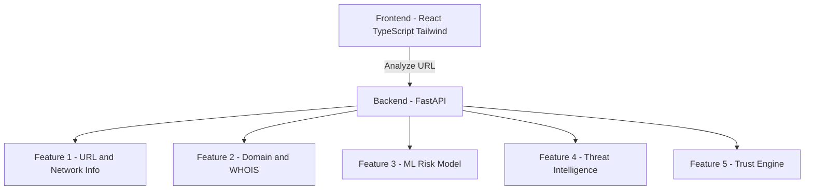

# 🛡️ CyberSentinel  
### 🔍 Verify Before You Trust

CyberSentinel is a **full-stack, ML-powered URL trust analysis platform** that helps users determine whether a website is **Genuine, Suspicious, or Malicious** by combining **machine learning**, **domain intelligence**, and **live threat-intelligence APIs**.

> 🚀 Built as a real-world cybersecurity system — not a demo.

---

## ✨ Key Features

### ✅ Feature 1: Basic URL & Network Information
- URL validation & normalization  
- Protocol detection (HTTP / HTTPS)  
- Domain extraction  
- IP address resolution  
- Country & ISP identification  

---

### 🌐 Feature 2: Domain & WHOIS Intelligence
- Domain registration details  
- Registrar information  
- Domain age calculation  
- Expiry & creation dates  
- WHOIS privacy detection  

---

### 🧠 Feature 3: Machine Learning–Based Risk Analysis
- ML model trained to detect risky URLs  
- Feature extraction from URL patterns & metadata  
- Predicts risk level using learned patterns  
- Outputs probabilistic confidence scores  

---

### 🔐 Feature 4: Live Threat Intelligence
- Google Safe Browsing integration  
- VirusTotal aggregation  
- Detects phishing, malware & blacklist status  
- Real-time security validation  

---

### 🧮 Feature 5: Final Trust Score & Verdict Engine
- Combines outputs from all previous features  
- Weighted scoring system (0–100)  
- Final verdict:
  - 🟢 Genuine  
  - 🟡 Suspicious  
  - 🔴 Malicious  
- Transparent reasoning for every decision  

---

## 🧱 System Architecture




---

## 🛠️ Tech Stack

### 🎨 Frontend
- React (Vite)
- TypeScript
- Tailwind CSS
- Responsive & mobile-friendly UI

### ⚙️ Backend
- FastAPI (Python)
- RESTful API design
- Modular service architecture

### 🤖 Machine Learning
- Scikit-learn
- Feature engineering on URL & domain data
- Trained classification models

### 🔐 Security & Intelligence
- Google Safe Browsing API
- VirusTotal API
- Passive data collection only (no scanning)

---

## 🌍 Live Demo

- **Frontend:** [https://cybersentinel-h4s.web.app](https://cybersentinel-h4s.web.app)  
- **Backend API:** [https://cybersentinel-t8ac.onrender.com](https://cybersentinel-t8ac.onrender.com)  
- **API Docs:** `/docs` (Swagger UI)

---

## 📡 API Overview

### POST `/analyze-url`

**Request**
```json
{
  "url": "https://example.com"
}
```

**Response (simplified)**
```json
{
  "basic_info": {},
  "domain_info": {},
  "ml_analysis": {},
  "threat_intelligence": {},
  "final_assessment": {
    "trust_score": 72,
    "verdict": "Suspicious",
    "confidence": 0.88
  }
}
```

## 🖥️ Frontend UI Sections

1. **Overview**
2. **Security**
3. **Domain**
4. **Technical**
5. **Reputation**

Each tab visualizes backend data in a clean, explainable, user-friendly way.

---

## 🧪 How to Run Locally

### Backend
```bash
cd backend
pip install -r requirements.txt
uvicorn main:app --reload
```

### Frontend
```bash
cd frontend
npm install
npm run dev
```

Create a `.env` file:
```env
VITE_API_URL=http://127.0.0.1:8000
```

---

## 🚀 Deployment

- **Backend** deployed on **Render**
- **Frontend** deployed on **42Web** (InfinityFree)
- Environment variables used for secure configuration
- CORS enabled for cross-platform access

---

## 📌 Use Cases

- Checking suspicious links
- Cybersecurity awareness
- Phishing detection
- Academic & research projects
- Hackathons & IEEE paper submissions

---

## 📄 Future Enhancements

- [ ] URL screenshot analysis
- [ ] Deep learning–based phishing detection
- [ ] Risk history & analytics
- [ ] User accounts & downloadable reports
- [ ] Geo-visualization of threats

---

## 👨‍💻 Author

**Manikanta Puppala**  
*Full-Stack Developer | ML & Cybersecurity Enthusiast*

---

> ⭐ **Final Note**  
> CyberSentinel is designed to behave like a real cybersecurity product.  
> Every decision is backed by machine learning + real-world threat intelligence.
